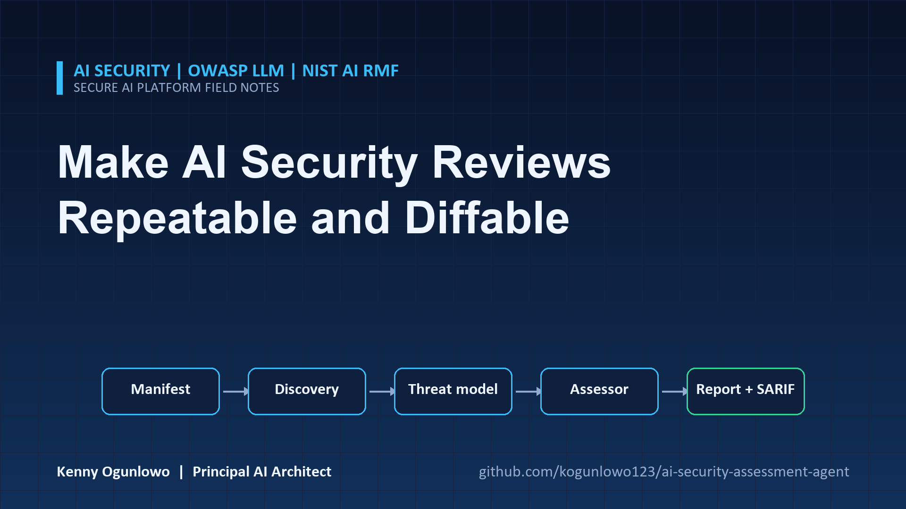
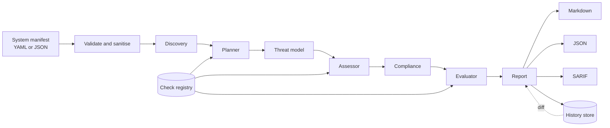
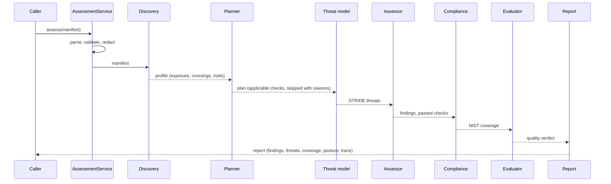
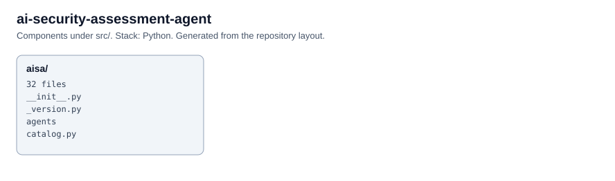

# AI Security Assessment Agent



> If this project is useful, a star helps other engineers find it.

A multi-agent tool that assesses the security posture of an AI application. You describe the system in
a short manifest (components, data flows, trust zones and which safeguards exist). Seven cooperating
agents then inventory it, model its threats, run 20 checks mapped to the OWASP Top 10 for LLM
Applications, score control coverage against the NIST AI RMF, quality-check their own output and
produce a report with prioritized remediation.

Everything except the optional narrative summary is deterministic and runs offline. There are no
API keys, network calls or model dependencies in the default configuration.

## Table of contents

- [Project overview](#project-overview)
- [Architecture](#architecture)
- [Features](#features)
- [Repository structure](#repository-structure)
- [Installation](#installation)
- [Quick start](#quick-start)
- [Detailed usage](#detailed-usage)
- [Manifest reference](#manifest-reference)
- [Configuration](#configuration)
- [Security](#security)
- [Testing](#testing)
- [CI/CD](#cicd)
- [Limitations](#limitations)
- [Roadmap](#roadmap)
- [Contributing](#contributing)
- [License](#license)

## Project overview

### What it is

A Python library and CLI that turns an architecture description into an assessment report. Each finding
names the affected components, cites the evidence it is based on, maps to OWASP LLM, STRIDE, NIST AI
RMF and MITRE ATLAS references, and carries a concrete recommendation.

### Why it exists

AI risk reviews are usually ad hoc: a workshop, a spreadsheet, a slide. Results are hard to compare
between systems or over time, and nobody can say why a rating was given. This tool makes the review
repeatable. The same manifest always yields the same findings, every finding traces to declared facts,
and runs can be diffed to show whether posture improved.

### Who should use it

- Security architects and AI governance teams running pre-release reviews.
- Platform teams that want an automated gate in CI when an AI system's architecture changes.
- Engineers who need a checklist of what "secure enough" means for an LLM application.

### Business value

| Outcome | Mechanism |
| ------- | --------- |
| Consistent reviews across teams | One control catalog and one scoring model for every system |
| Faster release decisions | Prioritized findings and a posture score instead of an open-ended workshop |
| Audit-ready evidence | Every finding lists the controls and flows it rests on |
| Drift detection | Stored runs are diffed to show new, resolved and escalated findings |
| CI enforcement | `--fail-on` returns a non-zero exit code; SARIF output feeds code-scanning dashboards |

## Architecture

### System architecture



### Agent architecture

| Agent | Responsibility |
| ----- | -------------- |
| **Discovery** | Builds the inventory: component counts, internet-facing and exposed components (reachability from the internet along declared flows), third-party components, sensitive data holders, boundary-crossing flows, agentic and RAG traits, high-risk tools. |
| **Planner** | Decides which registered checks apply to this system and records why the rest were skipped. |
| **Threat model** | Applies STRIDE rules to the architecture and attaches MITRE ATLAS technique references where a mapping is well established. |
| **Assessor** | Runs each planned check. Control-based checks score declared control status; architecture checks evaluate individual flows. Severity moves with exposure. |
| **Compliance** | Scores control coverage for each NIST AI RMF function (Govern, Map, Measure, Manage) and lists the gaps. |
| **Evaluator** | Audits the assessment itself: every finding needs evidence, a recommendation and valid framework references, and every planned check must have produced a result. |
| **Report** | Computes the posture score and rating, writes the executive summary and assembles the report. |

### Execution flow



### Data flow and scoring

1. **Manifest to profile.** Components, flows, trust zones and data classes become an exposure map.
2. **Checks to findings.** Each check names the controls it requires. Mean control credit
   (implemented 1.0, partial 0.5, absent or undeclared 0) below 1.0 raises a finding. Severity starts
   from a base level, moves up or down with exposure (for example an internet-reachable agent with
   payment tools makes prompt injection critical), and drops one level when controls are half in place.
   Flow-level architecture failures keep full severity.
3. **Posture score.** `100 * exp(-penalty / 80)`, where the penalty sums critical 25, high 12,
   medium 5 and low 2. The decay keeps scores comparable when a system has many findings.
4. **Rating.** The worst severity present, or `none`.

Undeclared controls count as not evidenced. The tool does not assume a safeguard exists because the
manifest is silent about it.

Design details and trade-offs are in [docs/architecture.md](docs/architecture.md), with decision
records in [docs/adr](docs/adr).

## Features

- **OWASP LLM Top 10 (2025) coverage**: all ten categories, each with at least one check.
- **STRIDE threat modelling** derived from trust zones and flows, with MITRE ATLAS references.
- **NIST AI RMF control coverage** per function, with a gap list.
- **Exposure-aware severity**: reachability from the internet, regulated data, agent capabilities and
  multi-tenancy all move severity.
- **Self-evaluation**: an evaluator agent rejects incomplete or untraceable findings.
- **Drift tracking**: a history store and diff show new, resolved and escalated findings between runs.
- **Outputs**: Markdown, JSON and SARIF 2.1.0.
- **CI gating**: `--fail-on <severity>` exit codes; `aisa diff` exits non-zero on regression.
- **Extensible**: register custom checks and controls without touching the agents.
- **Optional narrative**: an OpenAI or Anthropic model can write the executive summary, accepted only if
  every number in it appears in the facts it was given.
- **Safe input handling**: bounded manifest size, YAML safe loading, secret redaction, injection-aware
  handling of names before any model sees them.

## Repository structure

```
ai-security-assessment-agent/
├── .github/
│   ├── dependabot.yml
│   └── workflows/
│       ├── ci.yml                    # lint, format, types, tests, audit, build
│       └── codeql.yml
├── docs/
│   ├── architecture.md
│   └── adr/                          # architecture decision records
├── manifests/
│   ├── customer-support-rag.yaml     # deliberately weak sample
│   └── hardened-research-agent.yaml  # strong-posture sample
├── src/aisa/
│   ├── agents/
│   │   ├── discovery.py              # inventory, exposure, boundary crossings
│   │   ├── planner.py                # applicable checks and skip reasons
│   │   ├── threat_model.py           # STRIDE rules
│   │   ├── assessor.py               # runs checks, computes severity
│   │   ├── compliance.py             # NIST AI RMF coverage
│   │   ├── evaluator.py              # quality gate on the assessment
│   │   ├── report.py                 # posture, summary writers, report assembly
│   │   └── state.py
│   ├── providers/                    # HTTP client and optional chat clients
│   ├── reporting/                    # Markdown and SARIF renderers, writer
│   ├── catalog.py                    # OWASP ids, STRIDE, NIST functions, controls
│   ├── checks.py                     # check registry and built-in checks
│   ├── cli.py                        # aisa assess | validate | checks | diff
│   ├── config.py
│   ├── container.py                  # composition root
│   ├── graph.py                      # workflow engine
│   ├── history.py                    # stored runs and diffs
│   ├── models.py
│   ├── pipeline.py
│   ├── security.py                   # safe loading, redaction, sanitising
│   └── service.py
├── tests/
│   ├── unit/
│   ├── integration/
│   └── conftest.py
├── .env.example
├── CHANGELOG.md
├── CONTRIBUTING.md
├── Dockerfile
├── LICENSE
├── Makefile
├── SECURITY.md
├── pyproject.toml
├── requirements.txt
└── requirements-dev.txt
```

## Installation

Requirements: Python 3.10 or newer.

```bash
git clone <repository-url>
cd ai-security-assessment-agent
python -m venv .venv
source .venv/bin/activate            # Windows: .venv\Scripts\activate
python -m pip install -e ".[dev]"
```

Runtime-only install: `python -m pip install -e .`

## Quick start

Assess the bundled sample of a customer-support assistant with a hosted model, a vector index and a
refund tool:

```bash
aisa assess manifests/customer-support-rag.yaml --out report --format md,json,sarif
```

```
System: Customer Support Assistant
Rating: critical  Posture: 7/100
Findings: 3 critical, 9 high, 4 medium, 3 low
Wrote report/assessment.md
Wrote report/assessment.json
Wrote report/assessment.sarif
```

The three critical findings are prompt injection reaching an exposed agent that can issue payments
(LLM01-01), model output flowing unvalidated into the refund tool (LLM05-01) and excessive agency
(LLM06-01). Open `report/assessment.md` for evidence and recommendations.

The hardened sample comes out clean:

```bash
aisa assess manifests/hardened-research-agent.yaml --out report --fail-on low
```

```
System: Internal Research Assistant
Rating: none  Posture: 100/100
Findings: none
```

## Detailed usage

### 1. Gate a pipeline

```bash
aisa assess manifest.yaml --out report --format sarif --fail-on high
```

Exit code 0 when no finding reaches the threshold, 1 when one does, 2 on a usage or input error. Upload
`report/assessment.sarif` to a code-scanning dashboard to annotate the change.

### 2. Track posture over time

```bash
aisa assess manifest.yaml --out report --history
```

The run is stored under `AISA_HISTORY_DIR` and compared with the previous run of the same system.
Illustrative output after two controls were added:

```
Posture change: +23
New findings: none
Resolved findings: LLM01-01, LLM01-02
```

Compare two saved JSON reports directly; the command exits 1 if the newer one regressed:

```bash
aisa diff old/assessment.json new/assessment.json
```

### 3. Validate a manifest

```bash
aisa validate manifest.yaml
```

Unknown control names, dangling flow references, bad ids and unknown capabilities are reported with the
offending field.

### 4. Browse the catalog

```bash
aisa checks           # checks with severity, OWASP mapping and required controls
aisa checks --json    # machine-readable, including every control and its NIST references
```

### 5. Python API

```python
from pathlib import Path

from aisa import Settings, build_service

service = build_service(Settings())
report = service.assess_file(Path("manifests/customer-support-rag.yaml"))

print(report.rating, report.posture_score)
for finding in report.findings:
    print(finding.id, finding.severity.value, finding.title, finding.affected)
for name, coverage in report.compliance.functions.items():
    print(name, f"{coverage.score:.0%}", [gap.control for gap in coverage.gaps])
```

### 6. Custom checks

```python
from aisa import Settings, build_service
from aisa.checks import Check, default_registry
from aisa.models import Severity

registry = default_registry()
registry.register(
    Check(
        id="ORG-01",
        title="Vendor model lacks a signed data processing agreement",
        category="governance",
        base_severity=Severity.MEDIUM,
        controls=("third_party_review",),
        applies=lambda manifest, profile: profile.third_party,
        description="Hosted providers process regulated data under contract.",
        recommendation="Execute a DPA before production traffic.",
        skip_reason="No third-party components.",
    )
)
service = build_service(Settings(), registry=registry)
```

### 7. Narrative summary from a model

```bash
export AISA_LLM_PROVIDER=anthropic       # or: openai
export AISA_ANTHROPIC_API_KEY=...
aisa assess manifest.yaml --out report
```

The model receives aggregate facts and sanitised labels only, never raw manifest text. If its reply
contains a number that is not in those facts, is empty or oversized, or the provider fails, the
deterministic template summary is used instead.

## Manifest reference

```yaml
name: Customer Support Assistant        # required, max 120 chars
description: Public chat assistant       # optional
multi_tenant: true                       # raises severity of retrieval isolation findings
high_stakes: false                       # raises severity of misinformation and evaluation findings

components:
  - id: web_chat                         # lowercase letters, digits, - and _; 2 to 41 chars
    name: Web chat widget
    type: ui
    trust_zone: internet                 # internet | dmz | internal | third_party
    data_classes: [pii]                  # public internal confidential pii phi pci secrets
    capabilities: [write, payments]      # read network write delete exec payments email

flows:
  - {source: web_chat, target: gateway, data: [pii], authenticated: false, encrypted: true}

controls:
  input_filtering: partial               # implemented | partial | absent (true and false also accepted)
```

Component types: `llm`, `agent`, `tool`, `retriever`, `vector_store`, `data_store`,
`training_pipeline`, `model_registry`, `api`, `ui`, `code_executor`, `external_service`.

Control ids are validated against the catalog; run `aisa checks --json` for the full list of 34.

## Configuration

Read from `AISA_*` environment variables and an optional `.env` file. See [.env.example](.env.example).

| Variable | Default | Purpose |
| -------- | ------- | ------- |
| `AISA_LLM_PROVIDER` | `none` | `none`, `openai` or `anthropic` (narrative summary only) |
| `AISA_OPENAI_API_KEY` | unset | Also accepts `OPENAI_API_KEY` |
| `AISA_OPENAI_BASE_URL` | `https://api.openai.com/v1` | OpenAI-compatible endpoint |
| `AISA_OPENAI_CHAT_MODEL` | `gpt-4o-mini` | Model for the summary |
| `AISA_ANTHROPIC_API_KEY` | unset | Also accepts `ANTHROPIC_API_KEY` |
| `AISA_ANTHROPIC_MODEL` | `claude-sonnet-5` | Model for the summary |
| `AISA_ANTHROPIC_MAX_TOKENS` | `600` | Summary length cap |
| `AISA_MAX_MANIFEST_BYTES` | `1000000` | Larger manifests are rejected |
| `AISA_HISTORY_DIR` | `.aisa/history` | Where `--history` stores runs |
| `AISA_HTTP_TIMEOUT_SECONDS` | `30` | Upstream request timeout |
| `AISA_RETRY_ATTEMPTS` / `_MIN_WAIT` / `_MAX_WAIT` | `3` / `0.5` / `8` | Retry policy |
| `AISA_LOG_LEVEL` | `WARNING` | Log level |
| `AISA_LOG_JSON` | `true` | JSON logs to stderr, or plain text when `false` |

## Security

| Threat | Control |
| ------ | ------- |
| Malicious YAML | `yaml.safe_load` only; object construction tags are rejected |
| Oversized or malformed manifests | Size cap, strict schema (`extra=forbid`), bounded lists and string lengths |
| Secrets in a manifest | Redacted from every error message and log line |
| Prompt injection via manifest text | Names are sanitised and injection-like text is withheld before any model call; the model sees aggregate facts only |
| Model output that invents facts | Numbers in the narrative must appear in the supplied facts, otherwise the template is used |
| Path manipulation | Report file names are fixed (`assessment.md`, `.json`, `.sarif`) and never derive from the manifest |
| Markdown injection | User-controlled text is escaped in report cells |
| Vulnerable dependencies | `pip-audit`, Dependabot and CodeQL in CI |
| Container | Multi-stage build, non-root user |

See [SECURITY.md](SECURITY.md) for the policy and how to report a vulnerability.

## Testing

```bash
python -m pytest                                  # all tests, coverage gate at 80%
python -m pytest tests/unit                       # unit tests
python -m pytest -m integration                   # end-to-end tests
python -m pytest --cov --cov-report=term-missing
```

- **Unit tests** cover manifest validation, the catalog, discovery, planning, every check family,
  threat rules, compliance scoring, the evaluator, summary writers, renderers, history, providers and
  the graph engine.
- **Integration tests** run both sample manifests end to end, verify determinism with a fixed clock,
  exercise the CLI (including exit codes, history and diff), run the OpenAI and Anthropic summary paths
  against mock servers, and confirm hostile manifest text never reaches a model.
- Tests run offline. Static checks: `make lint` and `make typecheck` (`mypy --strict`).

## CI/CD

`.github/workflows/ci.yml` runs on every push to `main` and every pull request:

| Job | What it does |
| --- | ------------ |
| Lint, format and types | `ruff check`, `ruff format --check`, `mypy --strict` |
| Tests | Python 3.10 to 3.13 matrix with an 80% coverage gate |
| Dependency audit | `pip-audit` against `requirements.txt` |
| Build validation | Builds sdist and wheel, `twine check`, builds and smoke-tests the Docker image |

`.github/workflows/codeql.yml` runs CodeQL on pushes, pull requests and weekly. Dependabot proposes
weekly updates.

## Limitations

- **It assesses what the manifest says.** Declared controls are taken as stated and are not verified
  against the running system. Treat a clean report as "no gaps in the declaration", not proof of
  security.
- **Not a penetration test or an audit.** It does not send attacks to a live system.
- **Framework identifiers need verification.** OWASP LLM ids follow the 2025 list. NIST references
  point to specific subcategories where the mapping is clear and to the whole function otherwise.
  MITRE ATLAS technique ids are reference tags. Confirm all of them against the current published texts
  before citing them in an audit.
- **Scoring is a model, not a measurement.** Severity weights and exposure adjustments are documented
  and adjustable in code, but they are judgement calls and have not been calibrated against real
  incident data.
- **Coverage of controls is binary per check.** Depth (for example how good an input filter is) is not
  measured.

## Roadmap

| Milestone | Scope |
| --------- | ----- |
| Next | Evidence ingestion: import IaC (Terraform, Kubernetes) and SBOMs to verify declared facts |
| Next | Additional frameworks: ISO/IEC 42001 and EU AI Act risk-class mapping |
| Later | Live probes: prompt-injection and leakage test suites against a running endpoint |
| Later | Risk acceptance workflow with expiry dates, owners and waivers |
| Later | Web dashboard for fleet-level posture and drift |
| Later | Calibration study of severity weights against incident data |

## Contributing

Read [CONTRIBUTING.md](CONTRIBUTING.md) for setup, quality gates and how to add checks and controls.
Report vulnerabilities privately as described in [SECURITY.md](SECURITY.md).

## License

Released under the [MIT License](LICENSE).

<!-- architecture -->
## Architecture


