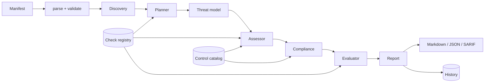

# Architecture

## Problem statement

AI security reviews are hard to repeat and hard to compare. Findings depend on who ran the workshop,
ratings cannot be traced to facts, and there is no cheap way to tell whether a redesign improved the
posture. This project encodes the review as data (a manifest), rules (checks and controls) and agents
with narrow responsibilities, so the same input always yields the same, explainable output.

## Requirements

| # | Requirement | Where it is met |
| - | ----------- | --------------- |
| R1 | Cover the OWASP Top 10 for LLM Applications | 13 checks across LLM01 to LLM10; the evaluator warns if a category is uncovered |
| R2 | Reason about architecture, not only controls | Discovery computes exposure and boundary crossings; STRIDE rules and ARCH checks use them |
| R3 | Every finding is traceable | Findings carry evidence lines, affected components and the controls consulted |
| R4 | Deterministic and offline by default | Rule-based agents; the only network use is the optional narrative |
| R5 | Detect drift | History store and `diff_reports` compare runs by finding id |
| R6 | Fit CI | Exit codes, SARIF output, no interactive steps |
| R7 | Safe with untrusted manifests | Size cap, safe YAML, strict schema, redaction, sanitised labels |
| R8 | Extensible | Check registry, catalog-driven controls, protocol-based summary writers |

## System overview



Agents are plain classes with a `run(state)` method. The workflow engine (`graph.py`) executes them in
order under a step budget and records a trace event (node, detail, duration) for each.

## Discovery and exposure

`build_profile` derives facts the checks rely on:

- **Exposed components.** A breadth-first search from every internet-zone component along declared
  flows. Anything reachable is treated as reachable by an attacker-controlled request.
- **Boundary crossings.** Flows whose endpoints sit in different trust zones.
- **Traits.** Agentic (an agent component, or a model flowing into a tool or executor), RAG, training
  pipeline, third-party components, holders of sensitive data, and tools with high-risk capabilities
  (`write`, `delete`, `exec`, `payments`, `email`).

## Checks and severity

A check declares:

- `applies(manifest, profile) -> affected component ids`. Empty means not applicable, and the planner
  records the skip reason. A check flagged `always` runs regardless.
- `controls`. The catalog controls that mitigate the risk. Alternatively, an `evaluator` function
  computes credit and evidence from flows for architecture checks.
- `adjust(manifest, profile, affected) -> int`. Moves severity up or down for exposure.

Evaluation:

1. Credit is the mean of `implemented = 1`, `partial = 0.5`, `absent or undeclared = 0`.
2. Credit of 1.0 passes. Anything less raises a finding.
3. Severity starts at `base_severity`, applies `adjust`, then drops one level if control credit is at
   least 0.5. Flow-based evaluators skip that last step: one unauthenticated crossing is a hole
   regardless of how many others are protected.
4. Severity is clamped between low and critical.

## Threat model

`derive_threats` applies STRIDE rules to the profile:

| STRIDE | Rule |
| ------ | ---- |
| Spoofing | Unauthenticated boundary-crossing flow |
| Tampering | Unencrypted crossing; prompt injection against each model; poisoned training data or index; compromised third-party model or dependency |
| Repudiation | Model present and `logging_monitoring` not implemented |
| Information disclosure | Sensitive data reachable from the internet; secrets in a system prompt; unencrypted flow carrying sensitive data |
| Denial of service | Exposed model without `rate_limiting` |
| Elevation of privilege | High-impact tool or executor reachable by a model, especially without `human_approval` |

MITRE ATLAS references are attached only where the mapping is well established (prompt injection,
prompt extraction, training-data poisoning, supply-chain compromise, data leakage).

## Compliance mapping

Each control lists NIST AI RMF references. A subcategory such as `MEASURE 2.7` is used where the fit is
clear. Otherwise the reference is the whole function (`MANAGE`). Coverage per function is the mean
control credit across all mapped controls, independent of which checks were planned, because framework
coverage is about which safeguards exist, not which risks a given architecture happens to trigger.

## Evaluator

The evaluator treats the assessment as its own work product and fails it when:

- a finding has no evidence or recommendation,
- a finding references an unknown OWASP id, NIST function, control or component,
- finding ids are duplicated,
- a planned check produced neither a finding nor a pass.

It warns when the registry has no check for an OWASP category. Failures do not abort the run; they are
printed in the report and as a CLI warning so a flawed assessment is visible rather than silently
shipped.

## Scoring

```
penalty = 25 * critical + 12 * high + 5 * medium + 2 * low
posture = round(100 * exp(-penalty / 80))
```

Exponential decay was chosen over subtraction so posture never floors at zero: a system with ten
critical findings still scores below one with three, which matters when ranking a portfolio.

## History and drift

`HistoryStore` writes one JSON file per run (`<system-slug>-<timestamp>.json`) atomically. `diff_reports`
compares two runs by finding id and reports new findings, resolved findings, severity changes and the
posture delta. A run is a regression when it adds findings, escalates one, or lowers the posture score.

## Optional narrative

`LLMSummaryWriter` sends aggregate facts (counts, total, score, top findings, NIST scores) as JSON
under a system prompt that treats the facts as data. Its reply is accepted only if it is non-empty,
under 1,500 characters and every number in it appears in the facts (or is 100). Anything else, and any
provider error, falls back to the deterministic template.

## Trade-offs

| Decision | Benefit | Cost |
| -------- | ------- | ---- |
| Manifest-driven assessment | Deterministic, offline, reviewable in a pull request | Reflects declared state, not the running system |
| Rule-based agents, not LLM agents | Reproducible and testable; no data leaves the environment | Cannot discover risks outside the rule set |
| Undeclared equals not evidenced | Conservative; encourages complete manifests | Sparse manifests look worse than they are |
| Fixed severity weights | Comparable across systems | Judgement calls, not calibrated to incident data |
| In-repo workflow engine | No framework dependency (see ADR 0001) | No checkpointing or streaming |

## Scalability

Assessments are stateless and cheap (milliseconds for hundreds of components), so scaling is a matter
of running many in parallel. The history store is a directory of files; a database-backed store can be
added behind the same `save` and `latest` methods for large fleets.

## Extensibility

- **Checks.** Register a `Check` on a `CheckRegistry` and pass it to `build_service`.
- **Controls.** Add an entry to `catalog.CONTROLS`; manifests validate against it automatically.
- **Summaries.** Implement `SummaryWriter`.
- **Renderers.** Add a function to `reporting` and a fixed file name.
